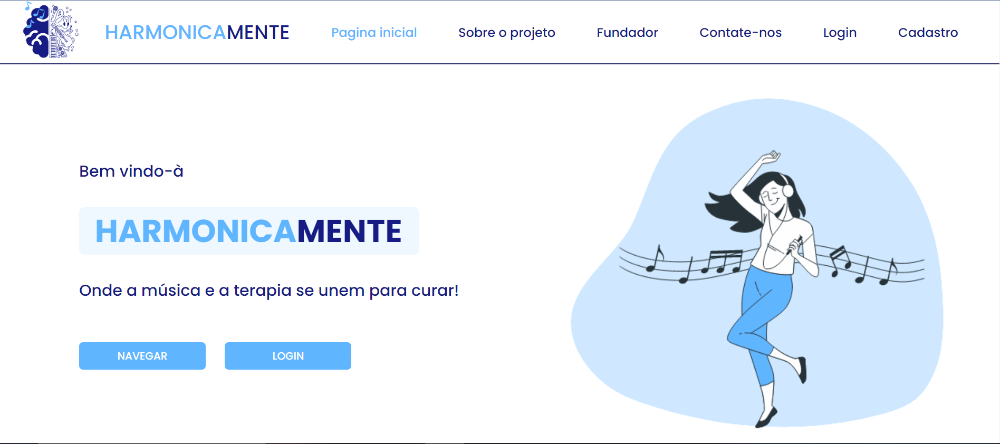
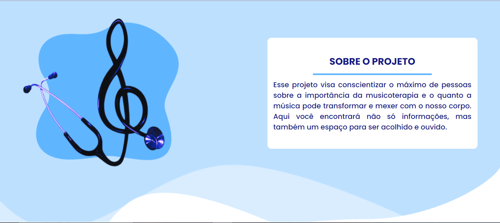
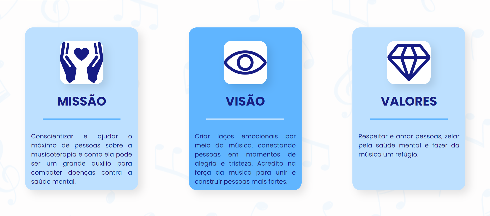
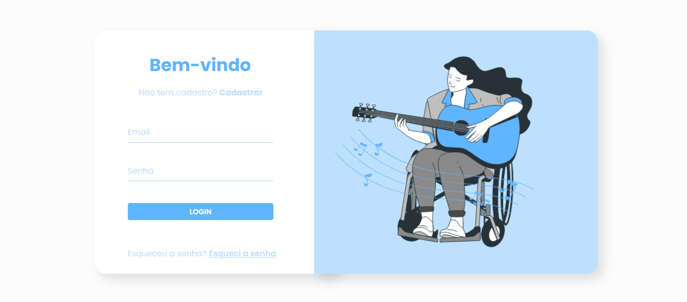
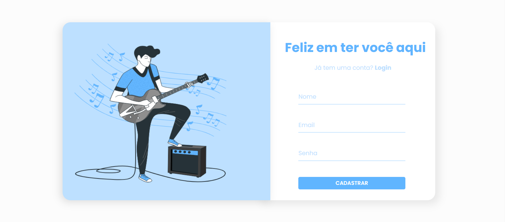
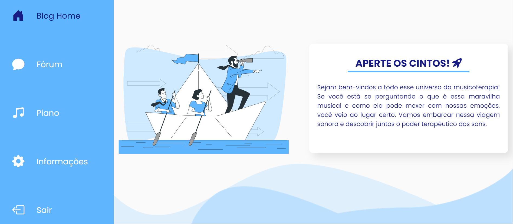
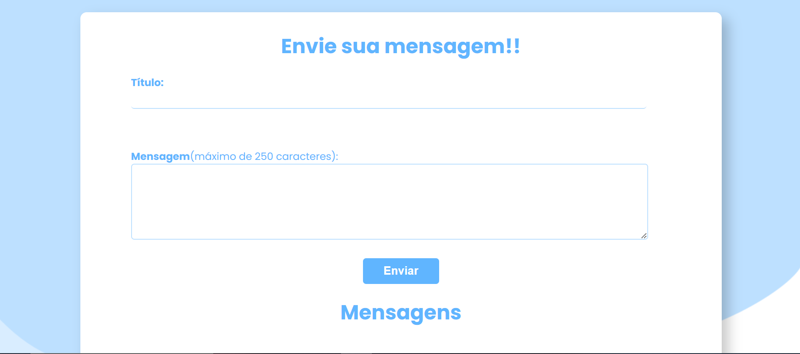
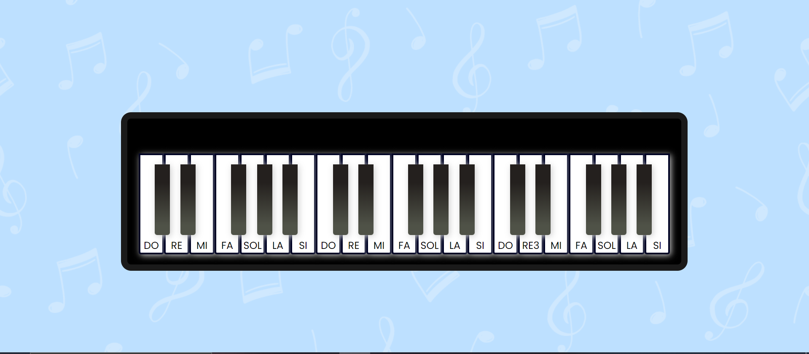

<h3 align="center">
  
</h3>

# 💙 Harmonicamente

 Harmonicamente é mais do que um simples website ou blog; é um espaço dedicado a conscientizar as pessoas sobre a importância do cuidado com a saúde mental, explorando o fascinante mundo da musicoterapia de maneira descontraída e animada! Aqui, mergulhamos nas notas e ritmos que podem transformar vidas, proporcionando insights valiosos sobre como a música pode ser uma aliada poderosa para o bem-estar emocional.

##  🖥️Site Institucional

O site oferece diversas informações e interações para que o usuário possa me conhecer melhor.
Aqui você terá acesso as minhas visões, missões e valores, poderá estar mais proximo de mim e conhecerá um pouco mais do projeto. Cadastre-se e acesse sua conta para embarcar nessa jornada! 

## 💬 Fórum

Um dos diferenciais do Harmonicamente são os nossos fóruns, um espaço acolhedor onde você pode expressar-se, ser ouvido e sentir-se seguro. Aqui, não oferecemos apenas uma comunidade, mas construímos uma verdadeira família. Valorizamos cada voz, entendendo que, por trás de cada experiência compartilhada, há uma jornada única. Nosso objetivo é criar um ambiente onde as trocas se transformem em apoio mútuo, onde cada membro encontre compreensão e empatia. No Harmonicamente, não estamos apenas explorando a importância da musicoterapia, estamos construindo laços emocionais que fortalecem o tecido da nossa comunidade.

## 🎹​ Piano virtual

Oferecemos uma experiência musical envolvente, projetada para ser mais do que apenas uma atividade relaxante. Este piano virtual é a porta de entrada para uma paleta de notas que pode transformar a sua atmosfera emocional. Seja você um amante da música ou alguém que está apenas começando a explorar os benefícios terapêuticos da melodia, nosso piano virtual está aqui para guiá-lo em uma experiência única de expressão pessoal.

## 💾 Banco de Dados
Aqui na Harmonicamente, utilizamos um banco de dados construído com o MySQL. Ele nos ajuda a armazenar e acessar informações de maneira segura e eficaz, o que significa que somos confiável e de alta qualidade e suas informações estão seguras conosco.
 Consulte nossas tabelas [nesses repositorio.](https://github.com/Jacslima/Harmonicamente/tree/main/Banco%20de%20Dados)

## ⚙ Tecnologias utilizadas
  
   

## 🤍 Obrigado pela atenção! 

